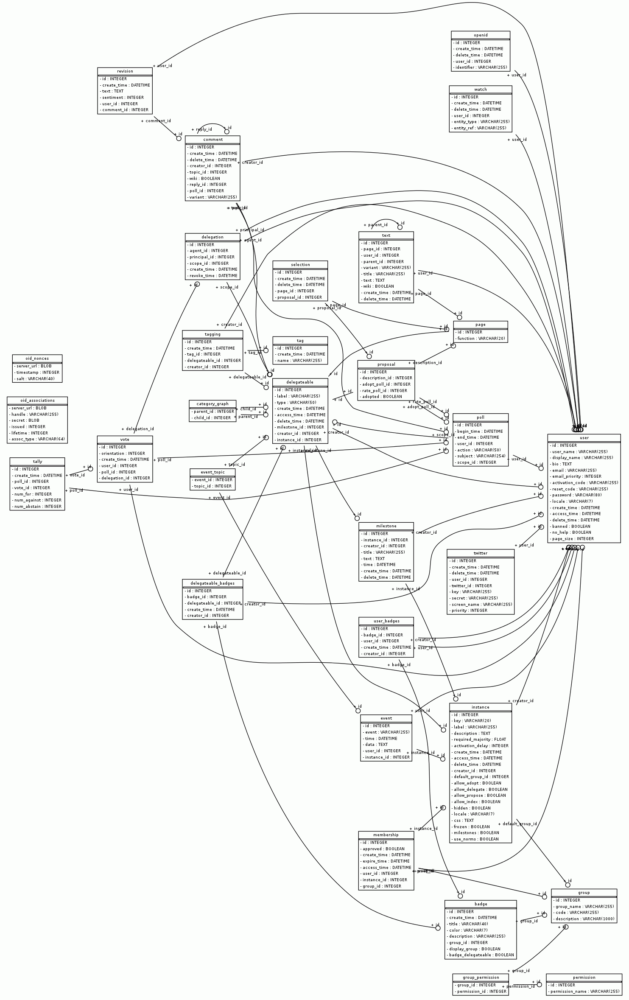

Architecture
============


Database and model classes
--------------------------

.. py:currentmodule:: adhocracy.model


Overview
''''''''

We have 4 top level content classes user work with:

:class:`page.Page`
  When the user creates a :term:`Norm` (respectively Paper, or german
  "Papier") through the web interface, he is internally creating a
  `Page` with the :attr:`page.Page.function` set to
  :data:`page.Page.NORM`. The text of the page is saved in
  `Text` objects in :attr:`page.Page.texts`, that may have different
  variants.

  Page is a subclass of :class:`delegateable.Delegateable`.

:class:`proposal.Proposal`
  The actual text of the proposal is saved as a `Page` object with the
  :attr:`Page.function` :attr:`page.Page.DESCRIPTIION`
  in an attribute :attr:`page.Page.description`.

  In a *Page* a user can propose changes to a *Page (Norm)*. These are saved as
  :class:`selection.Selection` objects (see below).

  Proposal is a subclass of :class:`delegateable.Delegateable`.

:class:`milestone.Milestone`
  A Milestone is used to represent a date or a deadline. Each Delegtable
  have a relation to one *Milestone*.

:class:`comment.Comment`
   Comments can be created for :class:`delegateable.Delegateable`
   objects.  The reference to the *Delegateable* is available as
   :attr:`comment.Comment.topic`.  Each comment is associated with a
   :class:`poll.Poll` to rate content.  If it is an answer to another
   *Comment* this is referenced with :attr:`comment.Comment.reply_id`. The
   text of an comment is stored as a :class:`revision.Revision`. If a comment
   is edited, a new *Revision* is created. *Revisions* have similar
   function for *Comments* like *Texts* have for *Pages*.

Some of the more interesting models and support classes are:

:class:`selection.Selection`
   A *Selection* is a "reference" object for the relation between
   *Pages (Norms)* and *Proposals* and stores additional information,
   especially when the relation was created or removed.

:class:`text.Text`
   ``Text`` objects are only used to save text for :class:`page.Page`
   objects. See *Page*.

:class:`revision.Revision`
   Store the text of a Comment. Similar to *Text*. See *Comment*.

:class:`poll.Poll`
  A *Poll* is an object representing a particular poll process a
  :class:Comment, :class:Proposal or :class:Page/Norm
  Single votes relate to the :class:Poll object.

:class:`vote.Vote`
  A `Vote` is a single vote from a user. It knows about the user whose vote
  it is, and if it was a delegated vote the useris of the delegatee that
  voted for the user.

:class:`delegation.Delegation`
  Created when a user delegates the voting to an delegatee. It knows
  about the user who (`principal_id`) delegated, who is the delegatee
  (`agent_id`) for which poll (`scope_id` - the id of the delegateable
  object).

:class:`delegateable.Delegateable`
  Base class for `Pages` and `Proposals` for which a user can delegate
  the voting. Sqlalchemy's joint table inheritance is used.

:class:`tally.Tally`
  A `Tally` saves the linear history of the :class:Poll noting which
  vote occured and what is the sum number of `for`/`against`/`abstains`.

:class:`watch.Watch`
  Users can subscribe to content changes and will be notified depending
  settings in their preferences. A *Watch* object is created
  in these cases.

:class:`meta.Indexable`
  Mixin class for content that should be indexed in Solr. It defines only
  one method :meth:`meta.Indexable.to_index` that collects data from
  the models and will be used automatically when a model object participates
  in a transaction.


Almost all model classes have a `classmethod` ``.create()`` to create
a new instance of the model and setup the necessary data or relationships.
Furthermore methods like ``.find()`` and ``.all()`` as convenient query
method that support limiting the query to the current
:class:`.model.instance.Instance` or in-/exclude deleted model instances.


Diagrams
''''''''

Tables



   Diagram of the mapped tables


   Diagramm of all model classes


Updating the diagrams
`````````````````````
To update the diagramms install graphviz_ and easy_install
`sqlalchemy_schemadisplay`_ into the environment adhocracy is installed in.
Then run `python /adhocracy/scripts/generate-db-diagrams.py`. It will
create the diagrams as GIF files. Finally replace the GIF files in
`adhocracy/docs/development` with the new versions.


Delegateables
'''''''''''''

.. currentmodule:: adhocracy.model.delegateable

A user can delegate his vote to another user for
:class:`comment.Comment`,
:class:`proposal.Proposal` and
:class:`page.Page`. This functionality is enabled by
inheriting from :class:`.Delegateable`

Inheritance is done with sqlalchemy's `joint table inheritance`_ where the
*delegateable* table is polymorphic on :attr:`delegateable.Delegateable.type`

Page Models
'''''''''''

The model class :class:`page.Page` has 2 uses in adhocracy that are
differentiated by the value of :attr:`page.Page.function`.

* A *Page* represents a *Norm* if :attr:`page.Page.function` is
  :attr:`page.Page.NORM`. This is the primary usage of Page.

* For every :class:`proposal.Proposal` a page is created
  and available as :attr:`proposal.Proposal.description`
  to manage the text and text versions of the :term:`proposal`.
  :attr:`page.Page.function` is :attr:`page.Page.DESCRIPTION` in this case.

Pages are *delegateable* and inherit from :class:`delegateable.Delegateable`.

Variants and Versions
`````````````````````

The text of the *Page* is not saved in the page table but created as a
:class:`text.Text` object. A page can contain different
variants of the text, and for each variant an arbitrary number of versions,
e.g.:

* initial text

  * version 1
  * version 2
  * ...

* other text variant

  * version 1
  * version 2
  * ...

* ...

Text variants are used for `Norms`. For the initial text, `variant` is set to
:const:`text.Text.HEAD`. This text variant is handled
special in the UI and labeled `Status Quo` in `Norms`. Other variants can be
freely named. All text variants are listed in :attr:`.Page.variants`.

Each variant can have a arbitrary number of versions. The newest version of the text is called the `head` (not to confuse with the default text variant
`Text.HEAD`). You can get the newest version of a specific variant with
:meth:`.Page.variant_head`. The newest versions of all variants is available
as :attr:`.Page.heads`. A shortcut to obtain the newest version of the `HEAD variant` is :attr:`.Page.head`.

Text variants are not used for pages that are used as the description of
:class:`proposal.Proposal` objects
(:attr:`proposal.Proposal.description`).

The poll tally of a variant or all variant can be optained with
:meth:`.Page.variant_tally` or :meth:`.Page.variant_tallies`

Polls are set up per variant, not for the Page object.


Page Hierarchies
````````````````
:class:`Page` objects (that have the funciton *Norm*) can be organized in a
tree stucture by setting another *Page (Norm)* object as one of the
:attr:`.Page.parents` of the current page. *Parents* can be an arbitrary
number of :class:`delegateable.Delegateable` objects, but only one, not
already deleted Page with the :attr:`.Page.function` :attr:`.Page.NORM`
is allowed. *Parents* are taken into account when we compute a
:term:`delegation graph`.

The subpages of a page are available as :attr:`.Page.subpages`.


Other functionality
```````````````````
Beside that `Pages` have functions and attributes to handle purging,
deleting, renaming,  Selections (`Page (Norm) <-> Proposal` relationships) and
other things. See the api documentation for :class:`.Page`


Indexing/Searching
------------------

.. py:currentmodule:: adhocracy

Indexing and searching is done with `sql(alchemy)` and `solr`.
Indexing with `solr` is done asyncronously most of the time while updates of
the rdbm is done syncronously most of the time. The asyncronous indexing
is done throug a `rabbitmq` job queue.

Types of search indexes
'''''''''''''''''''''''

Beside rdbm intern indexes adhocracy maintains application specific indexes
(that partly act as audit trails too):

* `solr' is used for full text and tag searches. It is an document oriented
  index. The index schema can be found in `adhocracy/etc/solr_schema.xml`
* new :class:`tally.Tally` objects are created with every
  new or changed vote and provide the current total of votes.

Update application layer indexes
''''''''''''''''''''''''''''''''

.. currentmodule:: adhocracy.models.hooks

adhocracy implements an sqlalchemy `Mapperextension` with
:class:`hooks.HookExtension` that provides hook
method to sqlalchemy that will be called before and after `insert`,
`update` and `delete` operations for every model instance that is part
of a commit. To determinate what to do it will inspect the model instance
for fitting hook methods.

The asyncronous system roughly works like this:

* :mod:`hooks` defines a list of event hook
  methods names that are also used as event identifiers (:const:.PREINSERT,
  :const:.PREDELETE, :const:.PREUPDATE, :const:.POSTINSERT,
  :const:.POSTDELETE, :const:.POSTUPDATE)
* All model classes defined in :data:`adhocracy.models.refs.TYPES`
  are patched by :func:`.init_queue_hooks`.
  A function that posts a message message to the job queue
  (`_handle_event`) is patched in as all the method names listed above.
  The post to the job queue contains the the entity (model class) and
  the event identifier.
* A number of callback functions is registered by
  :func:`adhocracy.lib.democracy.init_democracy` with the help of
  :func:`.register_queue_callback` in the hooks :const:`.REGISTRY`
* Everytime one of the patched models is inserted, updated, or deleted,
  a generic job is inserted into the jobqueue that contains the changed
  model instance and the event identifier.
* The background thread (`paster background <ini-file>`) picks up the jobs
  and calls :func:`handle_queue_message` which calls all registered
  callbacks.


To have indexing and searching working propperly you need:

* a working `rabbitmq`
* a working `solr`
* a running background process to process the jobs pushed into the
  `rabbitmq` job queue (`paster background <ini-file>`)

Read the install documentation for setup information.


Authentication and Permissions
------------------------------


.. _joint table inheritance: http://www.sqlalchemy.org/docs/orm/inheritance.html#joined-table-inheritance
.. _sqlalchemy_schemadisplay : http://pypi.python.org/pypi/sqlalchemy_schemadisplay/
.. _graphviz: http://www.graphviz.org/
