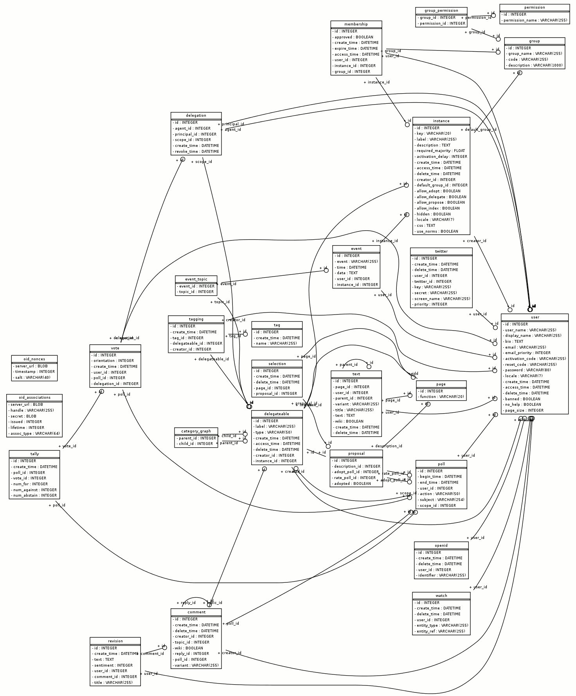
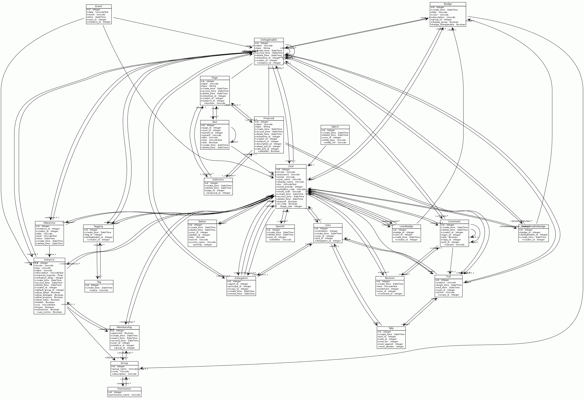

.. py:currentmodule:: adhocracy

Architecture
============

Database and model classes
--------------------------


Overview
''''''''

The two top level content classes the user works with are:

:py:class:`model.page.Page`
  When the user creates a :term:`Norm` through the web interface, he is
  internally creating a `Page` with the :py:attr:`function` 
  :py:data:`model.page.Page.NORM`. The text of the page is saved in
  `Text` objects in :py:attr:Page.texts, that may have different variants.

:py:class:`model.proposal.Proposal`
  The actual text of the proposal is saved as a `Page` object
  in an attribute 'description'.
  
Some of the more interesting support classes are:

:py:class:`model.text.Text`
   ``Text`` objects are only used to save text for :py:class:`Page`
   objects.

:py:class:`model.selection.Selection`
   A `Selection` is a "reference" object for the relation between
   :term:`norms` (:py:class:Page objects) and :py:class:Proposal objects
   that holds additional information, especially when the relation was
   created or removed.

:py:class:`model.poll.Poll`
  A `Poll` is an object representing a particular poll process a 
  :py:class:Comment, :py:class:Proposal or :py:class:Page/Norm
  Single votes relate to the :py:class:Poll object.

:py:class:`model.vote.Vote`
  A `Vote` is a single vote from a user. It knows about the user whose vote
  it is, and if it was a delegated vote the useris of the delegatee that
  voted for the user.

:py:class:`model.delegation.Delegation`
  Created when a user delegates the voting to an delegatee. It knows
  about the user who (`principal_id`) delegated, who is the delegatee
  (`agent_id`) for which poll (`scope_id` - the id of the delegateable
  object).

:py:class:`model.delegateable.Delegateable`
  Base class for `Pages` and `Proposals` for which a user can delegate
  the voting. Sqlalchemy's joint table inheritance is used.

:py:class:`model.tally.Tally`
  A `Tally` saves the linear history of the :py:class:Poll noting which
  vote occured and what is the sum number of `for`/`against`/`abstains`.

Almost all model classes have a `classmethod` ``.create()`` to create
a new instance of the model and setup the necessary data or relationships.
Furthermore methods like ``.find()`` and ``.all()`` as convenient query
method that support limiting the query to the current 
:py:class:`.model.instance.Instance` or in-/exclude deleted model instances.


Diagrams
''''''''

Tables



   Diagram of the mapped tables


   
   Diagramm of all model classes


Updating the diagrams
`````````````````````
To update the diagramms install graphviz_ and easy_install 
`sqlalchemy_schemadisplay`_ into the environment adhocracy is installed in.
Then run `python /adhocracy/scripts/generate-db-diagrams.py`. It will
create the diagrams as PNG files. You may want to convert them into smaller
GIF images with only 16 colors. Finally replace the GIF files in
`adhocracy/docs/development` with the new versions.


Delegateables
'''''''''''''

.. currentmodule:: adhocracy.model.delegateable

A user can delegate his vote to another user for
:py:class:`adhocracy.model.comment.Comment`,
:py:class:`adhocracy.model.proposal.Proposal` and
:py:class:`adhocracy.model.page.Page`. This functionality is enabled by
inheriting from :py:class:`.Delegateable`

Inheritance is done with sqlalchemy's `joint table inheritance`_ where the
`delegateable` table is polymorphic on `delegateable.type`

Page Models
'''''''''''

.. py:currentmodule:: adhocracy.models.page

The model class :py:class:`.Page` has 2 uses in adhocracy that are
differentiated by the value of :py:attr:`.Page.function`.

* A page represents a norm if :py:attr:`.Page.function` is 
  :py:attr:`.Page.NORM`. This is the primary usage of Page.

* For every :py:class:`adhocracy.model.proposal.Proposal` a page is created
  and available as :py:attr:`adhocracy.model.proposal.Proposal.description`
  to manage the text and text versions of the :term:`proposal`.
  :py:attr:`.Page.function` is :py:attr:`.Page.DESCRIPTION` in this case.

Pages are :term:`delegateable` and inherit from
:py:class:`adhocracy.model.delegateable.Delegateable`.

Variants and Versions
`````````````````````

The text of the `page` is not saved in the page table but created as a
:py:class:`adhocracy.model.text.Text` object. A page can contain different
variants of the text, and for each variant an arbitrary number of versions,
e.g.:

* initial text

  * version 1
  * version 2
  * ...

* other text variant

  * version 1
  * version 2
  * ...

* ...

Text variants are used for `Norms`. For the initial text, `variant` is set to
:py:const:`adhocracy.model.text.Text.HEAD`. This text variant is handled
special in the UI and labeled `Status Quo` in `Norms`. Other variants can be
freely named. All text variants are listed in :py:attr:`.Page.variants`.

Each variant can have a arbitrary number of versions. The newest version of the text is called the `head` (not to confuse with the default text variant
`Text.HEAD`). You can get the newest version of a specific variant with
:py:meth:`.Page.variant_head`. The newest versions of all variants is available
as :py:attr:`.Page.heads`. A shortcut to obtain the newest version of the `HEAD variant` is :py:attr:`.Page.head`.

Text variants are not used for pages that are used as the description of
:py:class:`adhocracy.model.proposal.Proposal` objects
(:py:attr:`adhocracy.model.proposal.Proposal.description`).

The poll tally of a variant or all variant can be optained with
:py:meth:`.Page.variant_tally` or :py:meth:`.Page.variant_tallies`

Polls are set up per variant, not for the Page object.


Page Hierarchies
````````````````
`Pages` (that are used as :term:`Norms`) can be organized in a tree stucture
by setting another `page` (Norm) object as one of the :py:attr:`.Page.parents`
of the current page. `parents` can be an arbitrary number of `Delegateable`
objects, but only one, not already deleted Page with the 
:py:attr:`.Page.function` :py:attr:`.Page.NORM` is allowed.

The subpages of a page are available as :py:attr:`.Page.subpages`.


Other functionality
```````````````````
Beside that `Pages` have functions and attributes to handle purging,
deleting, renaming,  Selections (`Page (Norm) <-> Proposal` relationships) and
other things. See the api documentation for :py:class:`.Page`


Indexing/Searching
------------------

.. py:currentmodule:: adhocracy

Indexing and searching is done with `sql(alchemy)` and `solr`.
Indexing with `solr` is done asyncronously most of the time while updates of
the rdbm is done syncronously most of the time. The asyncronous indexing
is done throug a `rabbitmq` job queue. 

Types of search indexes
'''''''''''''''''''''''

Beside rdbm intern indexes adhocracy maintains application specific indexes
(that partly act as audit trails too):

* `solr' is used for full text and tag searches. It is an document oriented
  index. The index schema can be found in `adhocracy/solr/schema.xml`
* new :py:class:`adhocracy.model.tally.Tally` objects are created with every
  new or changed vote and provide the current total of votes.

Update application layer indexes
''''''''''''''''''''''''''''''''

.. currentmodule:: adhocracy.models.hooks

adhocracy implements an sqlalchemy `Mapperextension` with
:py:class:`adhocracy.model.hooks.HookExtension` that provides hook
method to sqlalchemy that will be called before and after `insert`, 
`update` and `delete` operations for every model instance that is part
of a commit. To determinate what to do it will inspect the model instance
for fitting hook methods.

The asyncronous system roughly works like this:

* :py:mod:`adhocracy.model.hooks` defines a list of event hook
  methods names that are also used as event identifiers (:py:const:.PREINSERT,
  :py:const:.PREDELETE, :py:const:.PREUPDATE, :py:const:.POSTINSERT,
  :py:const:.POSTDELETE, :py:const:.POSTUPDATE)
* All model classes defined in :py:data:`adhocracy.models.refs.TYPES`
  are patched by :py:func:`.init_queue_hooks`.
  A function that posts a message message to the job queue
  (`_handle_event`) is patched in as all the method names listed above.  
  The post to the job queue contains the the entity (model class) and
  the event identifier.
* A number of callback functions is registered by
  :py:func:`adhocracy.lib.democracy.init_democracy` with the help of
  :py:func:`.register_queue_callback` in the hooks :py:const:`.REGISTRY`
* Everytime one of the patched models is inserted, updated, or deleted,
  a generic job is inserted into the jobqueue that contains the changed
  model instance and the event identifier.
* The background thread (`paster background <ini-file>`) picks up the jobs
  and calls :py:func:`handle_queue_message` which calls all registered
  callbacks.


To have indexing and searching working propperly you need:

* a working `rabbitmq`
* a working `solr`
* a running background process to process the jobs pushed into the 
  `rabbitmq` job queue (`paster background <ini-file>`)

Read the install documentation for setup information.


Authentication and Permissions
------------------------------


.. _joint table inheritance: http://www.sqlalchemy.org/docs/orm/inheritance.html#joined-table-inheritance
.. _sqlalchemy_schemadisplay : http://pypi.python.org/pypi/sqlalchemy_schemadisplay/
.. _graphviz: http://www.graphviz.org/
